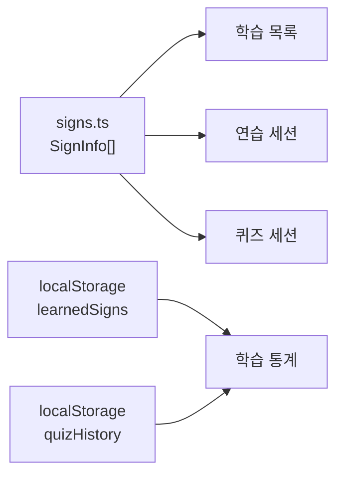
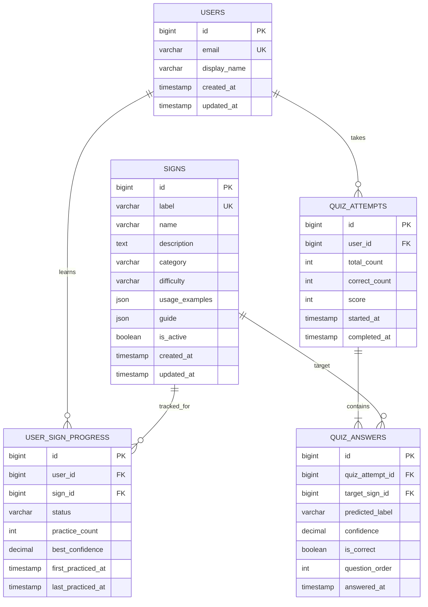

# SignMate 데이터 모델 및 ERD

## 1. 문서 목적

SignMate MVP에서 사용하는 데이터의 구조, 관계, 저장 규칙을 정의한다.

현재 애플리케이션에는 백엔드 데이터베이스가 없다. 수어 정보는
`src/data/signs.ts`의 정적 데이터로 관리하고, 학습 및 퀴즈 기록은 브라우저
`localStorage`에 저장한다.

이 문서의 **현행 데이터 명세**는 현재 코드에 적용된 구조이고, **권장 DB ERD**는
추후 회원 및 서버 저장 기능을 구현할 때 사용할 설계안이다.

---

## 2. 현행 데이터 구조



현행 구조에는 사용자 ID가 없다. 따라서 모든 기록은 브라우저와 기기에 종속되며,
브라우저 데이터 삭제 시 함께 삭제된다.

### 2.1 SignInfo

수어 한 개의 기본 정보다. `label`을 식별자로 사용한다.

| 필드 | 타입 | 필수 | 규칙 | 설명 |
|---|---|---:|---|---|
| `label` | `SignLabel` | Y | 고유값 | 코드에서 사용하는 수어 식별자 |
| `name` | `string` | Y | 빈 문자열 금지 | 화면에 표시하는 한글 이름 |
| `description` | `string` | Y | 빈 문자열 금지 | 수어 설명 |
| `usageExamples` | `string[]` | Y | 1개 이상 권장 | 사용 예문 |
| `difficulty` | `Difficulty` | Y | Enum | 난이도 |
| `category` | `SignCategory` | Y | Enum | 수어 분류 |
| `guide` | `string[]` | Y | 1개 이상 권장 | 동작 안내 문구 |

### 2.2 SignResult

카메라 또는 인식 모델이 반환하는 판정 결과다. 현재는 mock 데이터를 사용한다.

| 필드 | 타입 | 필수 | 규칙 | 설명 |
|---|---|---:|---|---|
| `detected` | `boolean` | Y | - | 손동작 인식 여부 |
| `label` | `SignLabel` | Y | Enum | 예측된 수어 식별자 |
| `name` | `string` | Y | `label`의 이름과 일치 | 표시용 수어 이름 |
| `confidence` | `number` | Y | `0.0 <= 값 <= 1.0` | 모델 신뢰도 |

`detected`가 `false`이면 `label`은 `unknown`을 사용하고, 화면에서는 인식 대기 상태로
표시하는 것을 원칙으로 한다.

### 2.3 Enum

#### SignLabel

| 값 | 표시 이름 | 비고 |
|---|---|---|
| `yes` | 네 | 등록됨 |
| `no` | 아니요 | 등록됨 |
| `thanks` | 감사합니다 | 등록됨 |
| `help` | 도와주세요 | 등록됨 |
| `water` | 물 | 등록됨 |
| `unknown` | 알 수 없음 | 인식 실패용, 학습 데이터에는 사용하지 않음 |

#### SignCategory

| 값 | 표시 이름 |
|---|---|
| `greeting` | 인사 |
| `response` | 응답 |
| `request` | 요청 |
| `daily` | 생활 |

#### Difficulty

| 값 | 표시 이름 |
|---|---|
| `easy` | 쉬움 |
| `normal` | 보통 |
| `hard` | 어려움 |

#### SessionMode

| 값 | 설명 |
|---|---|
| `translate` | 카메라에 보이는 수어 해석 |
| `practice` | 선택한 수어 따라 하기 |
| `quiz` | 제시된 수어 정답 판정 |

---

## 3. localStorage 명세

### 3.1 온보딩 완료 여부

| 항목 | 값 |
|---|---|
| Key | `signmate-onboarding-done` |
| Value | 문자열 `"true"` |
| 기본값 | Key 없음, 온보딩 표시 |

### 3.2 학습한 수어

| 항목 | 값 |
|---|---|
| Key | `signmate.learnedSigns` |
| 타입 | `SignLabel[]` |
| 기본값 | `[]` |
| 저장 시점 | 수어의 연습 버튼 선택 시 |

예시:

```json
["yes", "thanks", "water"]
```

규칙:

- 같은 `label`은 중복 저장하지 않는다.
- `unknown`은 저장하지 않는다.
- 현재 등록된 `SignLabel`만 저장한다.
- JSON 파싱에 실패하면 빈 배열로 처리한다.

### 3.3 퀴즈 기록

| 항목 | 값 |
|---|---|
| Key | `signmate-quiz-history` |
| 타입 | `QuizRecord[]` |
| 기본값 | `[]` |
| 보관 개수 | 최근 20개 |
| 저장 시점 | 전체 퀴즈 완료 시 |

```ts
interface QuizRecord {
  score: number;
  correct: boolean;
  savedAt: string;
}
```

예시:

```json
[
  {
    "score": 80,
    "correct": true,
    "savedAt": "2026-07-04T08:30:00.000Z"
  }
]
```

규칙:

- `score`는 `0` 이상 `100` 이하의 정수다.
- 점수는 `(정답 수 / 전체 문제 수) * 100`을 반올림한다.
- `savedAt`은 UTC 기준 ISO 8601 문자열로 저장한다.
- 20개를 초과하면 가장 오래된 기록부터 삭제한다.
- 현행 코드의 `correct`는 항상 `true`로 저장되므로 전체 퀴즈 결과를 표현하는 데
  의미가 부족하다. 서버 DB 전환 시 `correctCount`로 대체한다.

---

## 4. 핵심 업무 규칙

### 4.1 수어

- `label`은 영문 소문자 식별자이며 한번 배포한 값은 변경하지 않는다.
- 사용자에게는 `label`이 아니라 `name`을 표시한다.
- 한 수어는 하나의 카테고리와 하나의 난이도를 가진다.
- `unknown`은 인식 결과에만 사용하며 수어 마스터 데이터로 등록하지 않는다.
- 수어를 삭제해야 할 경우 기록 보존을 위해 실제 삭제보다 비활성 처리를 권장한다.

### 4.2 인식 및 정답 판정

- 정답 여부는 목표 수어의 `label`과 인식 결과의 `label`이 같은지로 판정한다.
- `detected = false`인 결과는 오답으로 처리한다.
- `confidence`는 화면에서 `confidence * 100`을 반올림해 백분율로 표시한다.
- 모델 연동 시 정답 인정 최소 신뢰도 기준을 별도로 정의해야 한다.
  권장 초기값은 `0.70`이며 모델 검증 결과에 따라 조정한다.

### 4.3 퀴즈

- 현재 퀴즈는 등록된 기초 수어 전체를 한 번씩 출제한다.
- 첫 문제만 무작위로 선택되고, 나머지는 정적 데이터 순서로 출제된다.
- 같은 퀴즈 세션 안에서는 한 수어를 중복 출제하지 않는다.
- 문제별 정답 여부는 다음 문제로 이동하는 시점에 확정한다.
- 전체 문제를 완료해야 퀴즈 기록을 저장한다.

### 4.4 학습 기록

- 현재는 연습 화면 진입을 학습 완료로 간주한다.
- 서버 DB 도입 시에는 `started`, `completed`, `mastered`처럼 학습 상태를 세분화할 수 있다.

---

## 5. 권장 DB ERD

회원과 서버 저장 기능을 추가할 경우 다음 구조를 권장한다.



### 5.1 USERS

| 컬럼 | 타입 예시 | 제약조건 | 설명 |
|---|---|---|---|
| `id` | `BIGINT` | PK | 사용자 ID |
| `email` | `VARCHAR(255)` | UNIQUE, NOT NULL | 로그인 이메일 |
| `display_name` | `VARCHAR(50)` | NOT NULL | 표시 이름 |
| `created_at` | `TIMESTAMP` | NOT NULL | 생성 시각 |
| `updated_at` | `TIMESTAMP` | NOT NULL | 수정 시각 |

### 5.2 SIGNS

| 컬럼 | 타입 예시 | 제약조건 | 설명 |
|---|---|---|---|
| `id` | `BIGINT` | PK | 내부 수어 ID |
| `label` | `VARCHAR(50)` | UNIQUE, NOT NULL | 불변 식별자 |
| `name` | `VARCHAR(100)` | NOT NULL | 한글 표시 이름 |
| `description` | `TEXT` | NOT NULL | 설명 |
| `category` | `VARCHAR(20)` | NOT NULL | 카테고리 Enum |
| `difficulty` | `VARCHAR(20)` | NOT NULL | 난이도 Enum |
| `usage_examples` | `JSON` | NOT NULL | 예문 배열 |
| `guide` | `JSON` | NOT NULL | 동작 가이드 배열 |
| `is_active` | `BOOLEAN` | NOT NULL, DEFAULT true | 노출 여부 |
| `created_at` | `TIMESTAMP` | NOT NULL | 생성 시각 |
| `updated_at` | `TIMESTAMP` | NOT NULL | 수정 시각 |

### 5.3 USER_SIGN_PROGRESS

| 컬럼 | 타입 예시 | 제약조건 | 설명 |
|---|---|---|---|
| `id` | `BIGINT` | PK | 학습 기록 ID |
| `user_id` | `BIGINT` | FK, NOT NULL | 사용자 ID |
| `sign_id` | `BIGINT` | FK, NOT NULL | 수어 ID |
| `status` | `VARCHAR(20)` | NOT NULL | `started`, `completed`, `mastered` |
| `practice_count` | `INT` | NOT NULL, DEFAULT 0 | 연습 횟수 |
| `best_confidence` | `DECIMAL(5,4)` | NULL, 0~1 | 최고 일치도 |
| `first_practiced_at` | `TIMESTAMP` | NULL | 최초 연습 시각 |
| `last_practiced_at` | `TIMESTAMP` | NULL | 최근 연습 시각 |

`(user_id, sign_id)` 조합에 UNIQUE 제약조건을 둔다.

### 5.4 QUIZ_ATTEMPTS

| 컬럼 | 타입 예시 | 제약조건 | 설명 |
|---|---|---|---|
| `id` | `BIGINT` | PK | 퀴즈 응시 ID |
| `user_id` | `BIGINT` | FK, NOT NULL | 응시 사용자 |
| `total_count` | `INT` | NOT NULL, 1 이상 | 전체 문제 수 |
| `correct_count` | `INT` | NOT NULL, 0 이상 | 정답 수 |
| `score` | `INT` | NOT NULL, 0~100 | 환산 점수 |
| `started_at` | `TIMESTAMP` | NOT NULL | 시작 시각 |
| `completed_at` | `TIMESTAMP` | NULL | 완료 시각 |

`correct_count`는 `total_count`를 초과할 수 없다. 미완료 응시는
`completed_at = NULL`로 유지하며 최고 점수 계산에서 제외한다.

### 5.5 QUIZ_ANSWERS

| 컬럼 | 타입 예시 | 제약조건 | 설명 |
|---|---|---|---|
| `id` | `BIGINT` | PK | 문제 응답 ID |
| `quiz_attempt_id` | `BIGINT` | FK, NOT NULL | 퀴즈 응시 ID |
| `target_sign_id` | `BIGINT` | FK, NOT NULL | 목표 수어 |
| `predicted_label` | `VARCHAR(50)` | NOT NULL | 모델 예측값 |
| `confidence` | `DECIMAL(5,4)` | NOT NULL, 0~1 | 모델 신뢰도 |
| `is_correct` | `BOOLEAN` | NOT NULL | 정답 여부 |
| `question_order` | `INT` | NOT NULL, 1 이상 | 출제 순서 |
| `answered_at` | `TIMESTAMP` | NOT NULL | 응답 확정 시각 |

`(quiz_attempt_id, question_order)` 조합에 UNIQUE 제약조건을 둔다.

---

## 6. 공통 데이터 규칙

- 모든 서버 시각은 UTC로 저장하고 화면에서 사용자 시간대로 변환한다.
- PK는 외부에 의미를 노출하지 않는 숫자 ID 또는 UUID를 사용한다.
- 생성된 퀴즈 및 학습 이력은 수어 이름이 변경되어도 유지한다.
- Enum 값 변경은 기존 데이터 마이그레이션과 함께 수행한다.
- 점수와 정답 여부는 클라이언트 값을 신뢰하지 않고 서버에서 다시 계산한다.
- 카메라 원본 영상은 기본적으로 저장하지 않는다.
- 손 랜드마크나 영상 데이터를 저장할 경우 사용자 동의, 보관 기간, 삭제 정책을
  별도로 정의한다.

## 7. 현재 구현과 권장 DB 매핑

| 현재 데이터 | 권장 DB |
|---|---|
| `src/data/signs.ts` | `SIGNS` |
| `signmate.learnedSigns` | `USER_SIGN_PROGRESS` |
| `signmate-quiz-history` | `QUIZ_ATTEMPTS` |
| 퀴즈 중 일시적인 문제 결과 | `QUIZ_ANSWERS` |
| 브라우저 단위 사용자 | `USERS` 로그인 사용자 |

## 8. 구현 시 우선 결정할 항목

1. 로그인 도입 여부와 사용자 식별 방식
2. 정답으로 인정할 최소 `confidence`
3. 학습 완료 상태의 정확한 기준
4. 퀴즈 문제 수와 무작위 출제 방식
5. 카메라 및 랜드마크 데이터의 저장 여부
